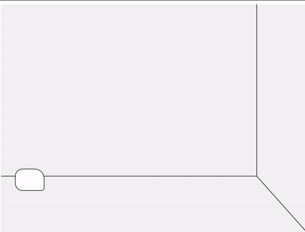
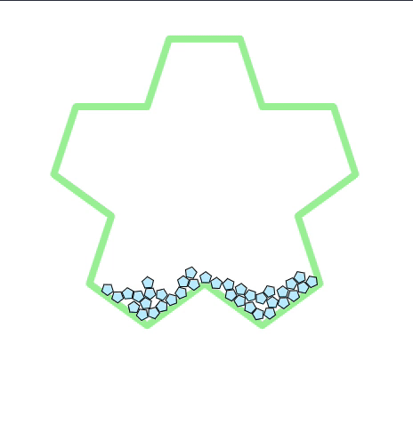

# Time
## Car

## Beads

## Resources
* [http://learn.digitalharbor.org/courses/creative-programming/lessons/using-timers-in-p5-js/](http://learn.digitalharbor.org/courses/creative-programming/lessons/using-timers-in-p5-js/)
* [https://creative-coding.decontextualize.com/making-games-with-p5-play/](https://creative-coding.decontextualize.com/making-games-with-p5-play/)
* [https://github.com/quinton-ashley/p5play-web/blob/main/demos/tumbler.js](https://github.com/quinton-ashley/p5play-web/blob/main/demos/tumbler.js)
* [https://editor.p5js.org/kjhollen/sketches/H1z3T6n3m](https://editor.p5js.org/kjhollen/sketches/H1z3T6n3m)
* [https://editor.p5js.org/chelseamwatson/sketches/2itMP7mkj](https://editor.p5js.org/chelseamwatson/sketches/2itMP7mkj)
